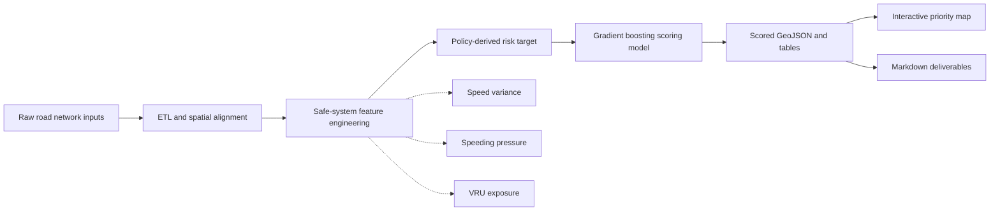

# Road Speed Safety Scoring

[](https://www.python.org/)
[](https://pandas.pydata.org/)
[](https://scikit-learn.org/)
[](https://geojson.org/)
[](https://developer.mozilla.org/en-US/docs/Web/HTML)

An end-to-end geospatial pipeline for scoring road segments by speed-safety risk and prioritizing locations for speed-limit review or intervention.

The project standardizes road network inputs, engineers safe-system speed features, trains an interpretable scoring model, and exports policy-ready tables, GeoJSON layers, markdown reports, and an interactive HTML priority map.

## What It Does

This is a road-segment risk scoring workflow. It is designed to answer:

- Which road segments show stronger speed-safety risk signals?
- Where are speeding pressure, speed variance, and vulnerable road user exposure highest?
- Which segments should be prioritized for speed-limit review, traffic calming, or enforcement?

The main outputs are:

| Output | Meaning |
| --- | --- |
| `speed_safety_score` | 0-100 operational speed-safety risk score |
| `risk_band` | `Low`, `Moderate`, or `Critical` |
| `safety_scored_network.geojson` | Scored geospatial road network |
| `highest_priority_segments.csv` | Ranked review/intervention list |
| `safety_score_map.html` | Standalone interactive map |

## Pipeline Architecture



## Tech Stack

| Area | Tools |
| --- | --- |
| Data processing | Python, pandas, NumPy |
| Machine learning | scikit-learn, `HistGradientBoostingRegressor` |
| Geospatial format | GeoJSON, GeoPackage-compatible inputs |
| Outputs | CSV, Parquet, GeoJSON, Markdown |
| Visualization | Standalone HTML, CSS, Canvas JavaScript |

## Repository Structure

```text
configs/       JSON configuration for each pipeline stage
scripts/       ETL, features, scoring, visualization, packaging
deliverables/  Markdown reports generated from pipeline outputs
README.md      Project overview and usage guide
```

Local source data and generated outputs are intentionally excluded from the repository.

## Data Privacy

This repository is intended to contain code, configuration, and public-safe documentation only.

Do not commit:

- raw road network inputs
- `data/` outputs
- `.geojson`, `.gpkg`, `.csv`, `.parquet`, `.pkl`, spreadsheet, or GIS sidecar files
- credentials, local exports, or generated model artifacts

The pipeline expects those files to exist locally when running, but they should remain outside version control.

## Quick Start

Run the complete workflow:

```bash
python scripts/run_pipeline.py
```

Run from a later stage:

```bash
python scripts/run_pipeline.py --from-step scoring
```

Available stages:

```text
alignment -> features -> scoring -> visualization -> deliverables
```

## Stage Guide

| Stage | Command | Main purpose |
| --- | --- | --- |
| Alignment | `python scripts/alignment.py --config configs/scope.json` | Normalize schemas, filter target road classes, validate geometries |
| Features | `python scripts/features.py --config configs/features.json` | Build speed variance, speeding pressure, VRU exposure, quality flags |
| Scoring | `python scripts/scoring.py --config configs/scoring.json` | Train scoring model and assign risk bands |
| Visualization | `python scripts/visualization.py --config configs/visualization.json` | Build standalone interactive priority map |
| Deliverables | `python scripts/package_outputs.py --config configs/package.json` | Generate markdown reports and publish notes |

## Model Summary

The scoring model is a scikit-learn pipeline:

```text
ColumnTransformer
  -> numeric passthrough
  -> categorical OneHotEncoder
  -> HistGradientBoostingRegressor
```

The model predicts a policy-derived `risk_target` built from:

| Component | Signal |
| --- | --- |
| `speed_variance_kmh` | Difference between V85 speed and median speed |
| `speeding_pressure` | Share of over-limit travel adjusted by sample confidence |
| `vru_exposure_index` | Rule-based vulnerable road user exposure proxy |

Important caveat: the current project does not use observed crash ground truth labels. Evaluation metrics show how well the model reproduces the scoring target and prioritization logic, not crash prediction accuracy.

## Feature Highlights

| Feature | Description |
| --- | --- |
| `speed_variance_kmh` | `max(v85_speed_kmh - median_speed_kmh, 0)` |
| `sample_confidence` | Log-scaled confidence from weighted sample size |
| `speeding_pressure` | Over-limit percentage weighted by sample confidence |
| `vru_exposure_index` | Exposure proxy using road class, land use, and urban percentage |
| `feature_quality_flag` | `usable`, `low_sample`, `partial_features`, or `geometry_only` |

## Interactive Map

Build the map:

```bash
python scripts/visualization.py --config configs/visualization.json
```

Open the local HTML output:

```text
data/processed/visualization/index.html
```

Or serve it locally:

```bash
python scripts/serve_visualization.py
```

Then open:

```text
http://127.0.0.1:8094/data/processed/visualization/
```

The map includes:

- risk-band filters
- pan and zoom controls
- hover/click segment details
- top-priority segment list
- recommended intervention language

## Outputs

Typical generated outputs include:

```text
data/processed/alignment/road_network_aligned.geojson
data/processed/features/features.parquet
data/processed/scoring/scored_segments.csv
data/processed/scoring/safety_scored_network.geojson
data/processed/visualization/safety_score_map.html
deliverables/technical_report.md
deliverables/geospatial_visualization.md
```

Generated data products are local artifacts and should not be committed.

## Requirements

The scripts require Python plus common data and ML packages:

```text
pandas
numpy
scikit-learn
pyarrow or fastparquet
```

Install dependencies in your preferred environment before running the pipeline.

## Documentation

For stage-by-stage command details and exact output paths, see:

```text
scripts/README.md
```
